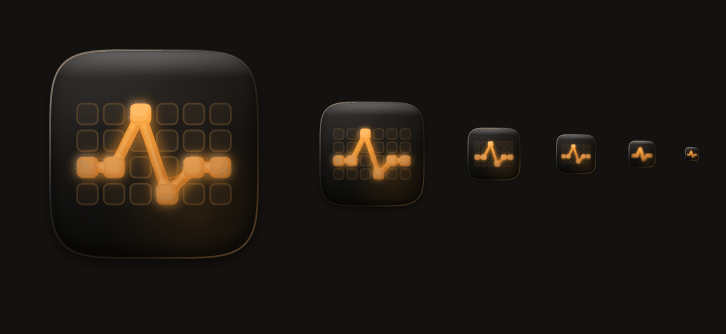

# Liquid glass app icon

A recipe for a night-studio app icon: a deep tungsten slab, one amber mark lit
from within, a sheet of glass over both. It is the icon language that goes with
the kit — so two apps built from it look like they came from the same studio
without being the same picture.



Drawn on canvas and cut into `.icns` and `.ico` with no design tool in the loop,
so the icon is a file you edit and re-run rather than a binary somebody has to
open Figma to change.

```bash
cp recipes/app-icon/{glass.js,cut-icons.cjs} <your-app>/build/icon/
cp recipes/app-icon/forge.example.html       <your-app>/build/icon/forge.html
# edit forge.html: replace the mark, keep everything else
<your-app>/node_modules/.bin/electron build/icon/cut-icons.cjs build/icon/forge.html build
```

Out come `build/icon.icns`, `build/icon.ico` and `build/icon.png` — the exact
names electron-builder picks up on its own.

## The three layers

Always in this order. The order is the recipe.

| | what | why |
|---|---|---|
| 1 | **`tile()`** — the slab | `#241e18 → #0b0a08`, cut to a macOS superellipse |
| 2 | **your mark**, drawn through `lit()` | the only per-app part |
| 3 | **`glass()`** — over everything | caustic, two speculars, inner shadow, fresnel rim |

**Keep the tile genuinely dark.** The instinct is to lift it so the icon "reads
better". It does the opposite: the accent then has nothing to be brighter than,
and the whole thing goes muddy. The first draft of the Patchbay icon was a warm
brown tile and it looked like a scuffed penny.

**`lit()` is three passes and all three earn it** — a blurred bloom, the solid
gradient form, then a sheen offset toward the light. Skipping the third is why a
mark looks flat. Offsetting it far enough to *see* as a line is worse: the shape
reads as doubled. That happened on a cable stroke and had to be pulled back to a
blurred `w * 0.11`.

**The broad specular is cool** (`#e2eeff`) against warm content. That temperature
contrast is the single thing the eye reads as glass. A warm highlight over a
warm tile just looks like a lighter tile.

## Draw the squircle yourself

macOS does **not** mask an `.icns`. Ship a plain rounded rectangle and it sits
subtly wrong next to every system icon — and `border-radius` gets the corner
curvature wrong in a way people notice without being able to name. `squircle()`
is a superellipse at `n = 5`, which is close enough to Apple's that nobody has
ever asked.

## Two drawings, one family

Below **32 px** a detailed mark turns to mush. Ship a simplified variant for
16 and 32 and the full one above — Apple does exactly this with its own icons.

`cut-icons.cjs` asks the forge for `'small'` at ≤32 and `'full'` above, so the
only thing you write is the second drawing. Keep the same tile, the same light
and the same silhouette idea; a genuinely different picture at 16 px reads as a
different app in the Finder sidebar.

The contact sheet at the bottom of `forge.example.html` exists for this. **Look
at the 16 and the 32, not the 512** — the big one always looks fine, and it is
never the one that fails.

## Pick a mark that is yours

The generic audio symbols — a waveform, a note, a knob, a slider — are what
every other app in the folder already used, and one of them is probably the host
app's own logo. Patchbay's mark is a signal chain across the Quad Cortex's own
4-row grid, because that grid is what the app actually edits. Rejected on the
way: a patch cable between two jacks (read as a magnifier), a single socket (a
camera lens), a waveform (the vendor's own icon is a spike, so it read as a
knockoff), a knob (a speedometer).

Cheap test: describe the mark in four words without naming the app. If the
sentence would fit fifty other apps, keep drawing.

## Render with the engine you ship

`cut-icons.cjs` runs Electron, which is the same Chromium your app renders with,
so what the forge draws is exactly what the user sees. Another rasteriser gets
blur radii and gradient interpolation subtly different and you find out at
1024 px.

It uses `canvas.toDataURL()`, **not** `capturePage()`. The canvas is N×N device
pixels by construction so display scale cannot get into it — which is not true
of `capturePage`, whose offscreen path returns the host's Retina scale and
ignores `--force-device-scale-factor`. That one cost an afternoon on a poster
renderer in the same house style.

## The `.ico` is written by hand, and that is fine

`iconutil` ships with macOS and makes the `.icns`. There is no equivalent for
`.ico`, and the usual answer is a Python or ImageMagick dependency for what is a
6-byte header, a 16-byte directory entry per image, and the PNGs verbatim —
since Vista an entry may hold a PNG as-is. `ico()` in `cut-icons.cjs` is forty
lines and removes the dependency entirely.

One trap: **256 is stored as `0`** in the width and height bytes. Write 256 and
the file is quietly wrong.

## Files

| | |
|---|---|
| `glass.js` | the drawing kit — `squircle` `tile` `lit` `bore` `glass` `paint`. No imports, no build step. |
| `cut-icons.cjs` | render every size, write `.icns` / `.ico` / `.png` |
| `forge.example.html` | a worked mark, and the contact sheet you iterate against |

`glass.js` is deliberately plain ESM rather than part of the package build:
it is loaded by a `<script type="module">` in whatever window is rendering, and
that has to work without a bundler. If you would rather `import { paint } from
'@singz/ui/icon'`, promoting it into `src/` is a small change — it has no React
dependency and no imports of its own.

## Shipping it

electron-builder finds `build/icon.icns` and `build/icon.ico` by name. Commit
the three outputs as assets and regenerate with a script:

```json
"scripts": { "icons": "electron build/icon/cut-icons.cjs build/icon/forge.html build" }
```

Requiring a render on every package run is a poor trade — icons change about
twice a year.

One last thing: **keep the icon stable**. People find an app by the shape in
their dock. A new mark reads as a different app, so change it on a real pivot,
not because you had an idea on a Tuesday.
